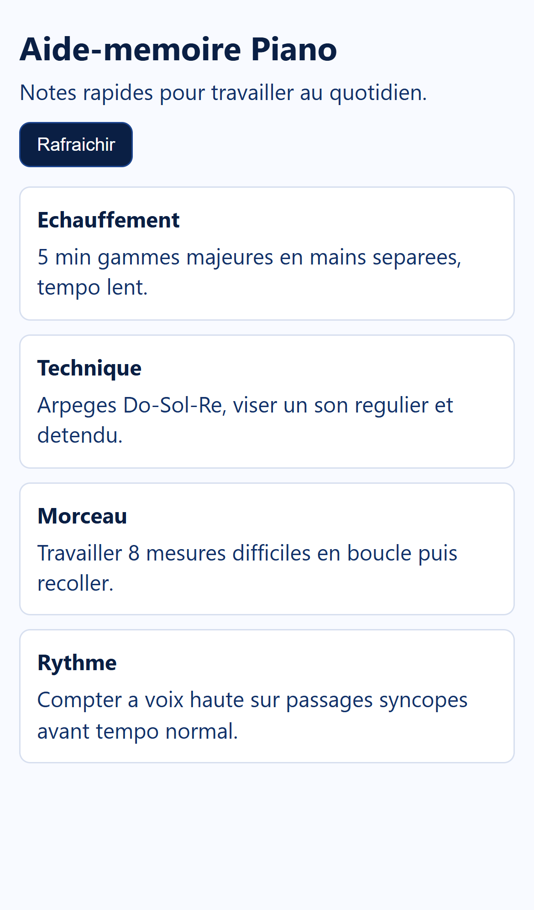
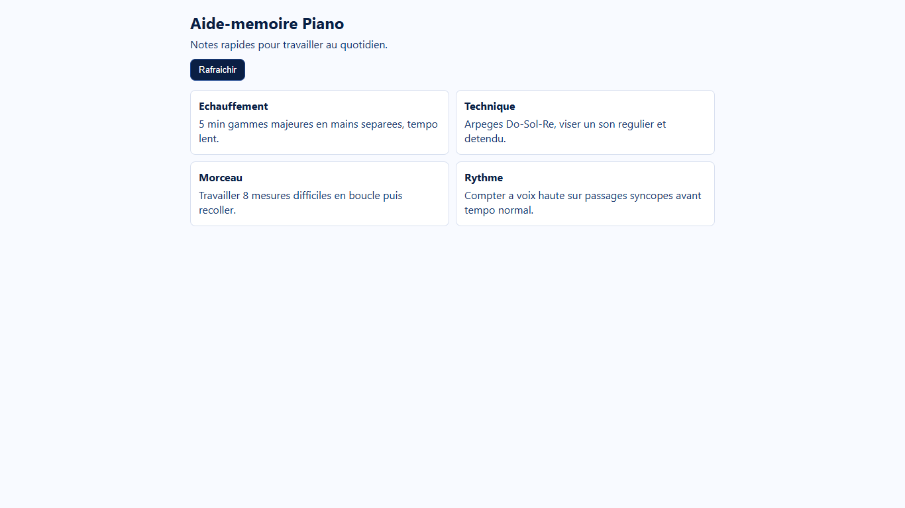

# Aide-memoire Piano - Mobile-First Full-Stack JS

Application web simple pour pianiste, construite en JavaScript full-stack :
- Frontend mobile-first avec Vite
- Backend Node.js avec Express
- Connexion API frontend <-> backend

## Structure du projet

- mobile-dashboard/ : frontend SPA
- backend/ : API Node.js
- README.md : documentation du projet

## Fonctionnalites

- Affichage de cartes aide-memoire pour la pratique du piano
- Chargement des donnees depuis l'API Node.js
- Bouton Rafraichir pour recharger les cartes
- Interface responsive mobile-first
- Creation de nouvelles notes depuis le frontend
- Edition et suppression des notes via REST API
- Mode offline-first avec cache local (`localStorage`)
- Synchronisation automatique des actions en attente au retour de la connexion
- Mise a jour en temps reel des nouvelles notes via WebSocket

## Stack technique

- Frontend : HTML, CSS, JavaScript (ES6), Vite
- Backend : Node.js, Express, CORS, ws (WebSocket)

## Installation et execution

### 1) Backend

Dans le dossier backend :

```powershell
npm install
node server.js
```

API disponible sur :
http://localhost:3000/api/data

Operations REST disponibles :
- GET /api/data : lister toutes les notes
- GET /api/data/:id : lire une note
- POST /api/data : creer une note
- PUT /api/data/:id : mettre a jour une note
- DELETE /api/data/:id : supprimer une note

WebSocket disponible sur :
ws://localhost:3000/ws

### 2) Frontend

Dans le dossier mobile-dashboard :

```powershell
npm install
npm run dev
```

Application disponible sur :
http://localhost:5174

Note : Vite peut choisir un autre port (ex: 5173, 5174...) si un port est deja occupe.

## Captures d'ecran

### Vue mobile



### Vue desktop



## Workflow de l'application

1. Le frontend charge la page et execute main.js.
2. main.js appelle l'endpoint backend http://localhost:3000/api/data.
3. Le backend renvoie les cartes aide-memoire au format JSON.
4. Le frontend injecte ces donnees dans l'interface.
5. Le bouton Rafraichir relance la requete API.
6. Le frontend maintient aussi une connexion WebSocket pour recevoir les nouvelles notes en temps reel.

## Approche Offline-First

- Le frontend lit d'abord le cache local (`localStorage`) pour afficher les cartes, meme sans reseau.
- Lorsqu'une note est ajoutee hors ligne, elle est affichee immediatement en mode "en attente de synchro".
- L'action est stockee dans une file locale de synchronisation (`localStorage`).
- Les suppressions lancees hors ligne sont aussi stockees dans une file locale (`localStorage`) puis rejouees au retour en ligne.
- Au retour de la connexion (evenement navigateur `online`), la file est rejouee vers l'API.
- Une fois synchronisee, la note locale est remplacee par la version serveur.
- Le statut reseau est conserve dans `sessionStorage` pour tracer l'etat courant de la session.

## Fichiers importants

- Frontend principal : mobile-dashboard/index.html
- Styles : mobile-dashboard/style.css
- Logique frontend : mobile-dashboard/main.js
- API backend : backend/server.js
